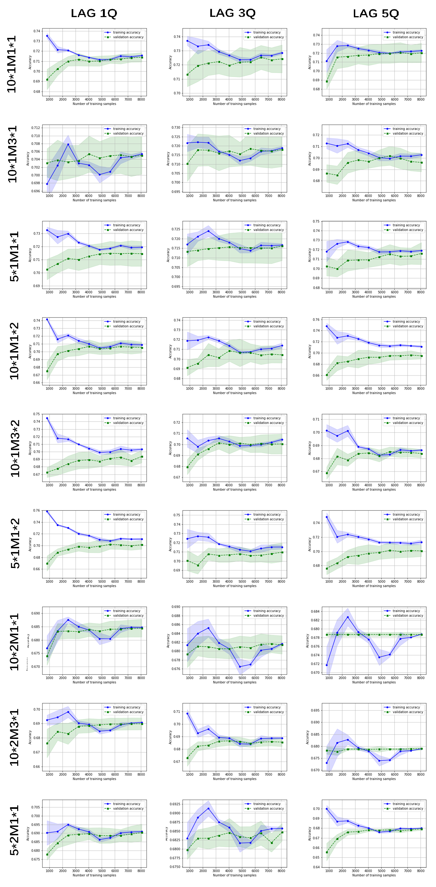

# A Recession Indicator Generated by Interest Rates

## Group Members

| Name         | StudentID  | GithubID                                          |
| ------------ | ---------- | ------------------------------------------------- |
| Yanrong Wu   | 1801212952 | [YanrongWu](https://github.com/YanrongWu)         |
| Anlei Liu    | 1801212887 | [lal0904](https://github.com/lal0904)             |
| Yiming Zhang | 1801212981 | [zhang1ming137](https://github.com/zhang1ming137) |
| Tianqi Gao   | 1901212578 | [preciousky](https://github.com/preciousky)       |

## 1  Introduction & Project Goal

### 1.1 Introduction

Economic recession is one of the most important economic phenomenon in macroeconomics. Predicting economic decline has always been a tricky but attractive topic. Due to the gaming of the market and the excessively complex elements included in the market, predicting the time point of economic decline has almost become an unsolvable problem in history. 

Referring to Professor's suggestion, our group decided to launch the project to practice the programming methods learned in the class to preliminarily explore the effect on financial recession, which is generated from the relationship between short-term market interest rates and long-term market interest rates on financial weakness, like the figure shown, the yield curve become abnormal in 2007 before the recession.

This project attempts to construct multiple indicator variables based on the interest rates of different financial products in different periods, and seeks the contribution of these indicator variables by machine learning method, moreover, for the chance to get more details of the theoretical explanation of economic recession.

### 1.2 Project Goal

When the gap between the long-term bonds and short-term bonds shrinks, it always indicates that the market anticipates the interest rates will fall in future as a hedge to upcoming downturn. In some extreme circumstances, this indicator can even alert the recession of the stock market. Our goal is to capture this relationship and make the model effective upon recession prediction.  

## 2  Data Acquisition and Data Selection

### 2.1 Raw Data Acquisition

1. We download the YTM (yield to maturity) of the US treasuries with various duration range from 1 month to 30 years,from [fred.stlouisfed.org](http://fred.stlouisfed.org). The data is arranged by daily data and the time span from 1962 to the present. More details about the raw data, please go to [AllRawData](./Data/AllRawData) folder.
2. Considering that only use the data of the YTM of treasuries maybe not sufficient，we collect more data contains the volatility of the stock market and the changes of the monthly economic indicators such as the rate of unemployment and core CPI from [Wind](https://www.wind.com.cn/). The raw data is stored in MACRO_DATA.csv also in [AllRawData](./Data/AllRawData) folder. 

### 2.2 Data Description and Data Selection

#### 2.2.1 Imbalance Problem of Y Data

- Discrete value to illustrate recession

  According to [NBER's Business Cycle Dating Committee](http://www.nber.org/cycles/recessions.html), important recessions of US is illustrated in the table below:

  

  According to the table, we can define the period between the peak and through of an cycle as recession interval. For example, the ***December 1969*** is a peak of an cycle and ***November 1970*** is the through of the same cycle. As a result, we can define the ***December 1969 to November 1970*** as an recession. Our process model of the fact is class all the date between an recession as 1 and 0 for others, which means that all ***y*** during the interval like ***December 1969 to November 1970*** is 1 and the others is 0. **But, there is a huge imbalance problem** if we use binary value to illustrate the degree of recession.

- Definition of Continuous Recession Index 

  1. Applying "The Econbrowser Recession Indicator Index"

  According to GDP-Based Recession Indicator Index from FRED called [JHGDPBRINDX](https://fred.stlouisfed.org/series/JHGDPBRINDX), we can get a definition of recession from [Hamilton, James](http://econbrowser.com/recession-index)

  2. Generated by Macroeconomic data according to Unemployment Rate, etc

     We also try to generate a index by some macro-economic data, like some shown in Data/AllRawData/MACRO_DATA.csv.

     • ***Weekly return:*** DJIA (Dow Jones Industrial Average) weekly return at the date

     • ***Return of past month:*** DJIA accumulated monthly return of the last month

     • ***Return of past half year:*** DJIA accumulated return of the last half year

     • ***Return of past year:*** DJIA accumulated return of the last year

     • ***Volatility:*** Volatility of DJIA this week

     • ***Average weekly Volatility of past month:*** the average of weekly Volatility of DJIA last month

     • ***Average weekly Volatility of past quarter:*** the average of weekly Volatility of DJIA last quarter

     > ***Consering the YTM is daily data but the some macro-economic date in the are arranged in weekly or monthly data. As a result, for everyday, we chose to trace back to the first accessible date to fill in the blanks in the features.***

     

In the End, We decided take "JHGDPBRINDX" as the recession index in our project. Because we haven't found a reasonable way by our team to generate recession index by macro-economic data. The trend of macro-dataset and that of recession is not always related as the above figure shown, the red line is the value of [JHGDPBRINDX](https://fred.stlouisfed.org/series/JHGDPBRINDX) . Then, we generate multiple classes from the continues index of recession as the final Y side data joining the model. Take the JHGDPBRINDX index value below 20 as class 0, above 80 as class 4, there are totally 5 classes, 0,1,2,3, and 4.

#### 2.2.2 Treasury Yield and Recession

When we check the correlation between Treasury Yield and Recession, we found a reasonable relation between them, as shown in the following figures. The following figures are interest spread with recessions highlighted. 

  

   

 

  

  

In general, the relation between them worth more effects to exploring further in the project, Here is a figure shown the overview trend among the variables. RECESSION_LABEL in the figure is the index [JHDUSRGDPBR](.Data/AllRawData/Part 1 Recession Index/JHDUSRGDPBR.csv).

#### 2.2.3 Corporate Bond and Recession

In the other hand, we also collect many kinds of yield from bond market, specially from corporate bond market, but we did not get the insight from the general trend of the yield of these bonds. The figure shows the trend of corporate bond yield and recession.

The inverse yield of corporate bond is not very predictable for the coming recession, for example, before the 2008 recession, there is not existing inverse yield rate in the data of HQMCB10M1, which means *10-Year High Quality Market (HQM) Corporate Bond Spot Rate* **(HQMCB10YR)** minus *1-Year High Quality Market (HQM) Corporate Bond Spot Rate* **(HQMCB1YR)**, and also the same for other two differences of bond yields.

#### 2.2.4 The Rate of Change upon Short-Term Yield and Recession

We also consider to add the feature of rate of change upon short-term yields to the X side of the model, However, according to the the article, [Information in the Yield Curve about Future Recessions]((https://www.frbsf.org/economic-research/publications/economic-letter/2018/august/information-in-yield-curve-about-future-recessions/)) (FRBSF Economic Letter No. 2018–20). Federal Reserve Bank of San Francisco. Yield curve inversions could cause future recessions because short-term rates are elevated and tight monetary policy is slowing down the economy. meanwhile, investors’ expectations of a future economic downturn could cause strong demand for safe, long-term Treasury bonds, pushing down long-term rates and thus causing an inversion of the yield curve. Historically, the causation may well have gone both ways. Thus, We will not to assess the effect generated by the changes upon short-term yield onto the predict model.

#### 2.2.5 Only Take Treasury Yields as Components for X Side

Finally, we decide to only use the Treasury Yields as the components in the X side in the model. We will try different combinations and lag among the yields to find some relation into the index of recession, i.e. the multiple-classes generated by [JHGDPBRINDX](https://fred.stlouisfed.org/series/JHGDPBRINDX)

Here is the final [source dataset](./Code/DATASET_FOR_CASES/DATASET.csv) collected and decided to applied in the model. We take the 1-year, 3-year, 5year, and 10-year treasury yield as the typical yield for short-term and long-term and apply them in the project. ***10M1*** means the difference of YTM of 10-year US treasury and 1-year US treasury. ***10M3***, ***5M1*** have the same meaning.

## 3  Feature Engineering - Feature Extraction and Generalized

### 3.1 Combination of Different Treasury Yields with Different Weights

We consider that the weight of different yields will have effects on the result, then we try 3 kind of combination of weight. They are *One-time Long-Term minus One-time Short-Term, One-time Long-Term minus Two-time Short-Term, and Two-time Long-Term minus One-time Short-Term.*

### 3.2 Tuning Lag between Term Spread  Curve and Recession Index

Considering that our target is to predict the likelihood of the recession occur. It's meaningless to use the synchronized features and classification. We tuning the lag as 1 quarter, 3 quarter, and 5 quarter. When we add the lag into the model the relationship between lag-based recession index and some term spread term shown like the figure below. The negative curve in the figure is minus-[JHGDPBRINDX](https://fred.stlouisfed.org/series/JHGDPBRINDX) with different lag options.

### 3.3 Feature Extraction through PCA

We plan the try some extraction technology upon the features if there is worthy value shown in the following experiments which only takes some term spread as the only variable on X side.

## 4. Experiment on ML models

### 4.1 Overview

#### 4.1.1 Single Term Spread

We use the features of interest spread to predict the recession. We take the ***10M1***, ***10M3***, and ***5M1*** as the feature in each case,respectively, and the multi-classification of recession as the ***y***. ***We totally have about 12700 daily data*** to fit in the model.

We tried three models(LR,SVM and Tree), by dividing the dataset into training and validation set, we can get the accuracy for both of them. We focus on the learning curve as the most important figure to examine the model, in each case we have different option upon.

- which pair of yields
- what weight for each yield rate
- how long is the lag
- which ML model to apply
- what hyperparameter to choose

In total, we launch ***81*** times experiments based ***27*** kinds of combination of the key variable by 3 ML method.

#### 4.1.2 Multiple Term Spread

- Additionally, we consider to apply feature extraction technology to get more information, but as you will see following, the result of the following experiments give other question to deal with before we "mix" the feature further.

### 4.2 Experiment Cases

Here are the 27 situation in our experiment, L_TERM is the option for which long-term yield to be chosen, L_WEIGHT is the relative weight for long-term yield, and LAG is the quarter-counting option to adjust the recession index on timeline. We apply three ML method on them, then generate totally ***81 learning curving figures*** as the main evidence to make further analysis.

| CASE       | L_TERM | S_TERM | L_WEIGHT | S_WEIGHT | LAG/Qua |
| ---------- | ------ | ------ | -------- | -------- | ------- |
| DATASET_01 | 10     | 1      | 1        | 1        | 1       |
| DATASET_02 | 10     | 1      | 1        | 1        | 3       |
| DATASET_03 | 10     | 1      | 1        | 1        | 5       |
| DATASET_04 | 10     | 3      | 1        | 1        | 1       |
| DATASET_05 | 10     | 3      | 1        | 1        | 3       |
| DATASET_06 | 10     | 3      | 1        | 1        | 5       |
| DATASET_07 | 5      | 1      | 1        | 1        | 1       |
| DATASET_08 | 5      | 1      | 1        | 1        | 3       |
| DATASET_09 | 5      | 1      | 1        | 1        | 5       |
| DATASET_10 | 10     | 1      | 1        | 2        | 1       |
| DATASET_11 | 10     | 1      | 1        | 2        | 3       |
| DATASET_12 | 10     | 1      | 1        | 2        | 5       |
| DATASET_13 | 10     | 3      | 1        | 2        | 1       |
| DATASET_14 | 10     | 3      | 1        | 2        | 3       |
| DATASET_15 | 10     | 3      | 1        | 2        | 5       |
| DATASET_16 | 5      | 1      | 1        | 2        | 1       |
| DATASET_17 | 5      | 1      | 1        | 2        | 3       |
| DATASET_18 | 5      | 1      | 1        | 2        | 5       |
| DATASET_19 | 10     | 1      | 2        | 1        | 1       |
| DATASET_20 | 10     | 1      | 2        | 1        | 3       |
| DATASET_21 | 10     | 1      | 2        | 1        | 5       |
| DATASET_22 | 10     | 3      | 2        | 1        | 1       |
| DATASET_23 | 10     | 3      | 2        | 1        | 3       |
| DATASET_24 | 10     | 3      | 2        | 1        | 5       |
| DATASET_25 | 5      | 1      | 2        | 1        | 1       |
| DATASET_26 | 5      | 1      | 2        | 1        | 3       |
| DATASET_27 | 5      | 1      | 2        | 1        | 5       |

Here are the learning curve figures, in order of LR, SVM, and TREE model.

#### Learning curves generated by Experiments by LR model:

#### Learning curves generated by Experiments by SVM model:

#### Learning curves generated by Experiments by Tree model:

> Here is the experiment log with more detail about the model generated by experiments. [LINK](./Code/Experiment_Log_20200426.md)

## 5  Experiment Assessment and Results

To analyze the above learning curve, we can found that SVM and LR models are not applied well for the data. We can not use the first two part of learning curve to generate our ideas. However, the results from tree model is relatively reasonable to interpret something. In the tree model, most of the learning curve is not a mess and have a convergent trend. Here are part of the results generated by the experiments. Detail can be found in the experiment log. [LINK](./Code/Experiment_Log_20200426.md)

| Case    | Model   | Pair of Yields | Weight(L/S) | accuracy        | Hyperparameter |
| ------- | ------- | -------------- | ----------- | --------------- | -------------- |
| E1*     | LR      | 10 vs 1        | 1/1         | 0.687 +/- 0.003 | C=1.0          |
| E1      | SVM     | 10 vs 1        | 1/1         | 0.679 +/- 0.000 | C=0.1          |
| E1      | Tree    | 10 vs 1        | 1/1         | 0.714 +/- 0.004 | max_depth=4    |
| E4      | Tree    | 10vs3          | 1/1         | 0.705 +/- 0.005 | max_depth=1    |
| ... ... | ... ... | ... ...        | ... ...     | ... ...         | ... ...        |
| E26     | Tree    | 5 vs 1         | 2/1         | 0.684 +/- 0.003 | max_depth=2    |
| ... ... | ... ... | ... ...        | ... ...     | ... ...         | ... ...        |

*the 1st experiment case, there is totally 27 experiment cases.

> For "onevsrestclassifier_estimator_C" of LR model, the range for tuning is {0.1, 1.0, 10};
>
> For "onevsrestclassifier_estimator_C" of SVM model, the range for tuning is {0.1, 1.0, 10};
>
> For "onevsrestclassifier_estimator_max_depth" of Tree model, the range for tuning is {1,2,3,4,5,6,7,8,9}

## 6  Analytical Interpretation

- According to the experiments, we found that tree model become convergent in several cases at the accuracy about 70%, it is not a reasonable explanation for the relationship between the term spread curve and recession index. The correction is not strong enough between a single term spread curve and recession index, though the inverse spread (i.e. the negative part of term spread) predicts the recessions relatively successfully in history.

- There is another possibility that we have not found the proper relative weight between different yields to generate a reasonable results.

- Other missing part may be the tuning part, there are so limited option for hyperparameters,   that the SVM and LR become almost messy according the generated learning curves. Also, kernel function is not applied in the limited experiment design.

- However, the inverse curve of Treasury yield is a more reasonable predictor than other yield rate, maybe the reason is because the unique position of Treasury market among financial market, which signs and marks the market confidence.

- Lastly, if we review the figure of recession index and Treasury yield spread curve, we can found that the relation between them may be a transaction of *log* function. When the long-short term spread is more near to the zero, more panic may be launched in the market and people's prediction, much more additional possibility of recession will occur.

  

## 7  Conclusion

Negative term spread is a good predictor however the whole yield rate curve is relatively weak to generate a relation onto the dynamic recession possibility or degree. There should be more internal relationship to explore behind the signal - "inverse yield point" and the whole process of changing yield rate - "the term spread curve".

## Reference  

[1] fred.stlouisfed.org: https://fred.stlouisfed.org/ 

[2] U.S. DEPARTMENT OF THE TREASURY: https://www.treasury.gov/resource-center/data-chart-center/interest-rates/Pages/TextView.aspx?data=yieldAll  

[3] The National Bureau of Economic Research: https://www.nber.org/cycles.html 

[4] St Louis Federal Research Economic Database: https://fred.stlouisfed.org/series/JHDUSRGDPBR  

[5] Wind 
[6] Ang, A., Piazzesi, M. and Wei, M. (2003). What Does the Yield Curve Tell Us about GDP Growth?. SSRN Electronic Journal.    

